# OpenGEO 开源前端 (opengeo-frontend)

MIT 开源的珊瑚 GEO **控制台**（React + Vite）：GEO 工作流、驾驶舱、知识库、Admin 后台。

| 项 | 说明 |
|---|---|
| **协议** | [MIT](./LICENSE) — 可自由使用、修改与商用（保留版权声明） |
| **仓库** | 公开 GitHub 仓库，无需付费即可克隆 |
| **配套小程序** | 独立仓库 [opengeo-mini](https://github.com/chameleon-nexus/opengeo-mini) |
| **运行依赖** | 完整本地工作流需配合 **opengeo-backend**（商业源码，见官网联系我们） |

官网：[OPENGEO](https://www.shanhugeo.com/opengeo.html) · [联系我们](https://www.shanhugeo.com/opengeo.html#contact)

## 目录

- [快速开始](#快速开始)
- [完整部署（前端 + 后端）](#完整部署前端--后端)
- [配置分工](#配置分工)
- [二次开发](#二次开发)

## 快速开始

```bash
git clone https://github.com/chameleon-nexus/opengeo-frontend.git
cd opengeo-frontend
cp .env.example .env.local
npm install
npm run dev
```

`.env.local` 至少设置 `VITE_API_BASE_URL=http://localhost:8002`（指向已部署的 opengeo-backend）。

微信小程序请克隆 [opengeo-mini](https://github.com/chameleon-nexus/opengeo-mini)。

> 尚无后端实例？请通过官网 [联系我们](https://www.shanhugeo.com/opengeo.html#contact) 获取部署支持。

## 完整部署（前端 + 后端）

### 1. 获取 opengeo-backend

后端为商业源码私有仓。通过官网 [联系我们](https://www.shanhugeo.com/opengeo.html#contact)（邮箱或微信）确认方案后，将开通 GitHub 仓库访问权限。

```bash
git clone git@github.com:chameleon-nexus/opengeo-backend.git
```

部署细节见授权后获得的私有仓内 README。

### 2. 后端必做清单（摘要）

- `.env`：`DATABASE_URL`（库名 `open_geo`）、`SECRET_KEY`、`REDIS_URL` 等
- `python scripts/bootstrap_open.py`
- `uvicorn`（**8002**）+ **Celery worker**
- Admin → **日常 AI 通道**（豆包 Key，设为默认并试跑）

### 3. 启动控制台

```bash
npm run dev
# http://localhost:3000 — admin / OpenGEO@init（首次登录后改密）
```

## 配置分工

| 配置位置 | 管什么 |
|----------|--------|
| `opengeo-backend/.env` | 数据库、Redis 等 |
| Admin → 日常 AI 通道 | 品牌词包等本地 LLM（**必做**） |
| `.env.local` | 控制台 API 地址 |

## 二次开发

请参阅 [AGENTS.md](./AGENTS.md)。

## 界面截图

> 图中品牌均为模拟测试数据，非真实客户数据。

SaaS 控制台界面预览（完整图集见 [OPENGEO 官网](https://www.shanhugeo.com/opengeo.html#screenshots)）。

| 控制台登录 | 工作台首页 | 新建优化 |
| --- | --- | --- |
| 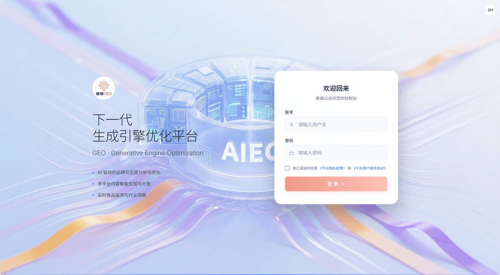 | 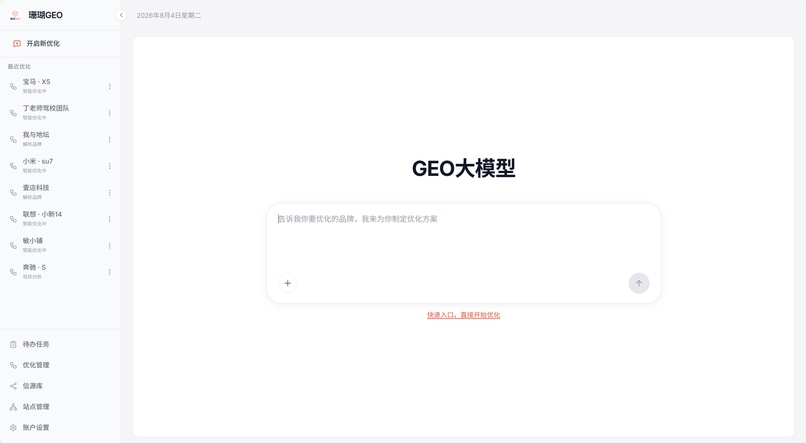 | 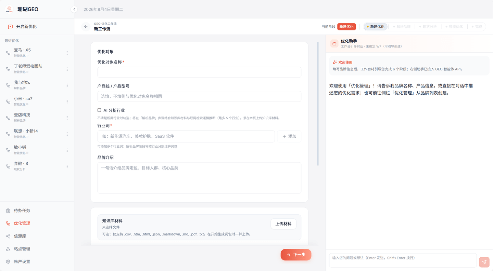 |

| 优化驾驶舱 | 新建优化 · AI 平台 | 解析品牌 · 词包 |
| --- | --- | --- |
| 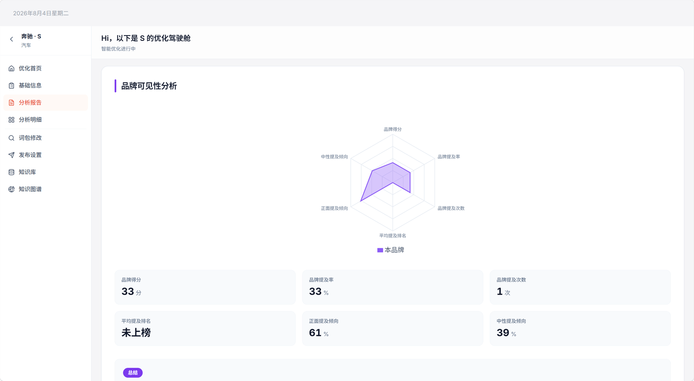 | 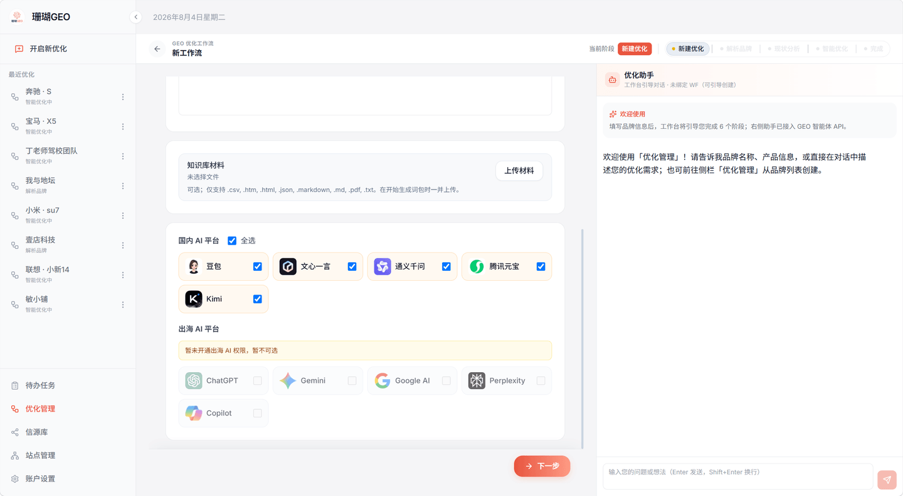 | 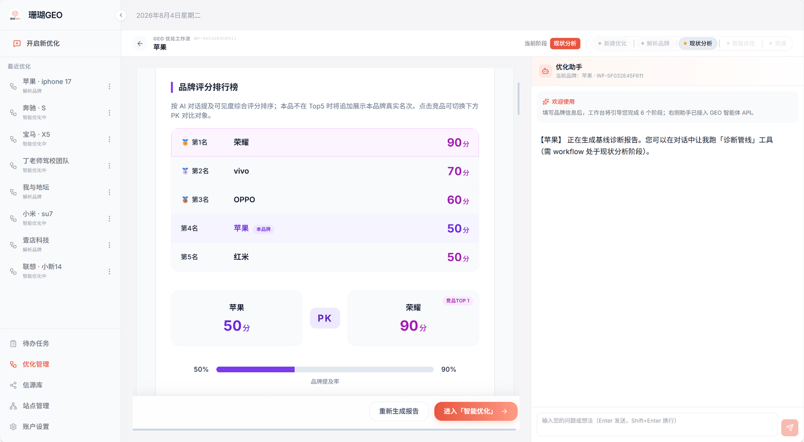 |

| 现状分析 | 智能优化 | 分析明细 |
| --- | --- | --- |
| 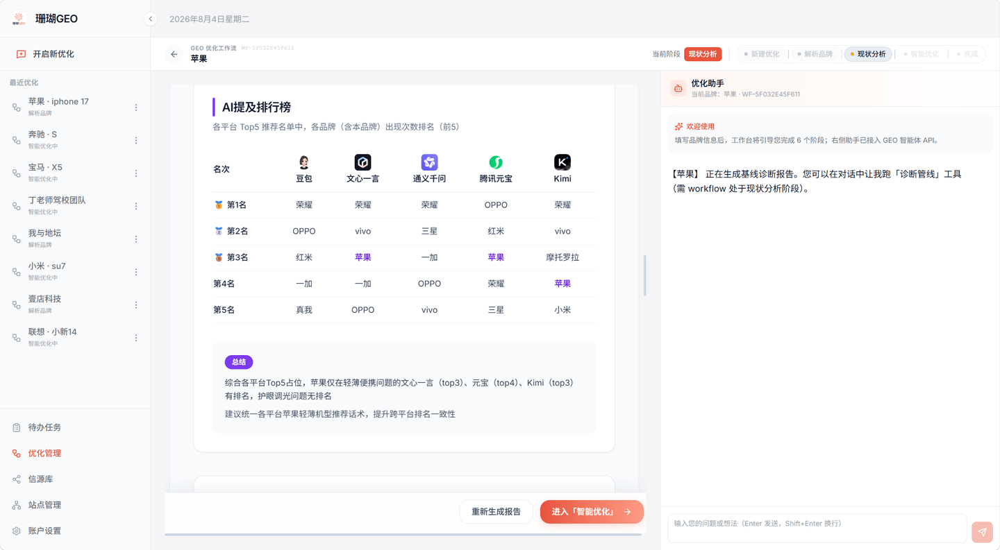 | 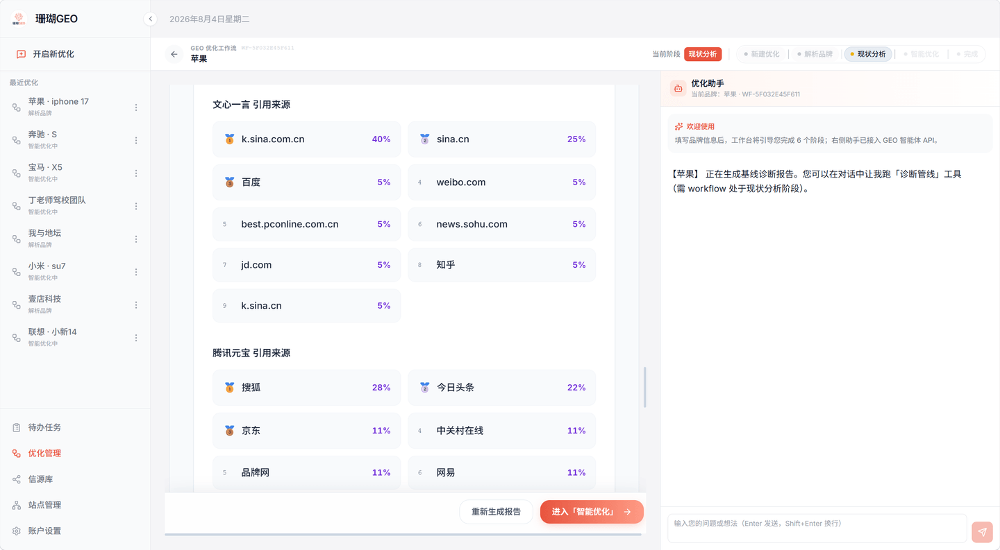 | 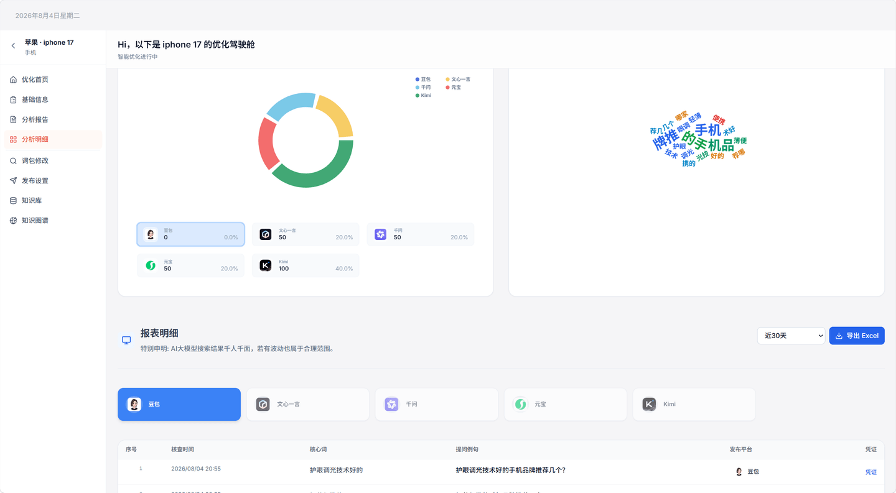 |

| 信源库 | 站点管理 |
| --- | --- |
| 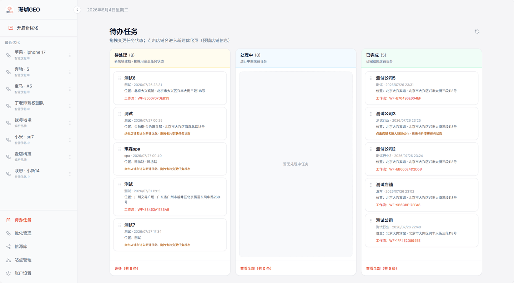 | 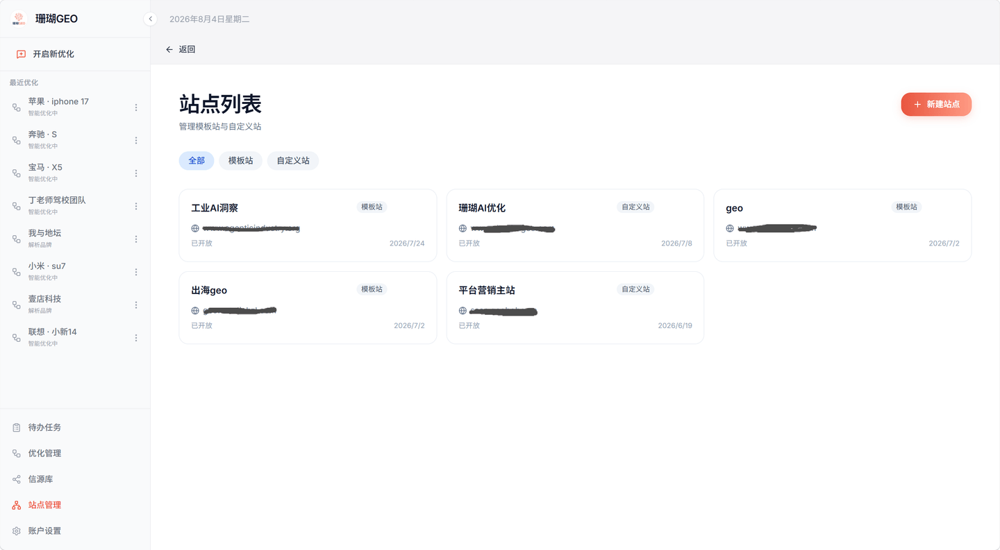 |

## 许可协议

MIT 协议，详见 [LICENSE](./LICENSE)。
